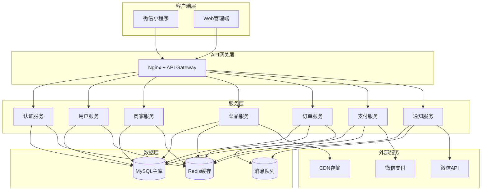

# HZCU-Order 点餐系统后端设计文档

## 概述

本文档定义了HZCU-Order点餐系统后端的完整技术架构，包括微服务设计、数据库结构、API接口、安全架构等。该后端系统需要支撑微信小程序用户端和Web管理端的全部功能，提供高并发、高可用的餐饮点餐服务。

**核心原则**：采用微服务架构，支持水平扩展，确保系统稳定性和可维护性。

## 指导文档对齐

### 技术标准
- **编程语言**: Java 17+
- **框架选择**: Spring Boot 3.x (提供企业级应用架构)
- **数据库**: MySQL 8.0 (主数据库) + Redis (缓存)
- **ORM框架**: Spring Data JPA + MyBatis Plus (类型安全的数据库操作)
- **API风格**: RESTful API + SpringDoc OpenAPI 3.0
- **文档标准**: Swagger/OpenAPI 3.0

### 项目结构
```
backend/
├── src/
│   ├── main/
│   │   ├── java/com/hzcu/order/
│   │   │   ├── HzcuOrderApplication.java    # 应用入口
│   │   │   ├── config/                       # 配置类
│   │   │   │   ├── DatabaseConfig.java
│   │   │   │   ├── RedisConfig.java
│   │   │   │   ├── SecurityConfig.java
│   │   │   │   └── SwaggerConfig.java
│   │   │   ├── modules/                      # 业务模块 (按领域划分)
│   │   │   │   ├── auth/                    # 用户认证模块
│   │   │   │   │   ├── controller/
│   │   │   │   │   ├── service/
│   │   │   │   │   ├── repository/
│   │   │   │   │   └── dto/
│   │   │   │   ├── user/                    # 用户管理模块
│   │   │   │   ├── canteen/                 # 商家管理模块 (canteen表)
│   │   │   │   ├── dish/                    # 菜品管理模块
│   │   │   │   ├── order/                   # 订单处理模块
│   │   │   │   ├── payment/                 # 支付集成模块
│   │   │   │   └── analytics/               # 数据统计模块
│   │   │   ├── common/                      # 共享组件
│   │   │   │   ├── exception/               # 异常处理
│   │   │   │   ├── utils/                   # 工具类
│   │   │   │   ├── constant/                # 常量定义
│   │   │   │   └── interceptor/             # 拦截器
│   │   │   └── security/                    # 安全相关
│   │   └── resources/
│   │       ├── application.yml              # 应用配置
│   │       ├── application-dev.yml          # 开发环境配置
│   │       └── application-prod.yml         # 生产环境配置
│   └── test/                                # 测试文件
├── docs/                                     # API文档
├── docker/                                  # Docker配置
└── pom.xml                                  # Maven配置
```

## 代码复用分析

### 现有组件利用
- **前端类型定义**: 复用小程序和Web端的TypeScript接口定义
- **图片处理**: 集成现有的图片上传CDN服务
- **支付集成**: 利用现有的微信支付商户配置

### 集成点
- **微信小程序**: 通过OpenID进行用户身份识别，Spring Security集成
- **Web管理端**: JWT令牌认证 + Spring Security RBAC权限控制
- **微信支付**: 统一支付接口和回调处理，Spring Boot定时任务
- **CDN存储**: 菜品图片和商家Logo的统一存储服务
- **缓存层**: Spring Boot + Redis 集成
- **消息队列**: Spring Boot + RabbitMQ 异步处理

## 架构设计

### 微服务架构



### 模块化设计原则
- **单一文件职责**: 每个Spring Service/Repository负责特定业务领域
- **组件隔离**: 小型、专注的Spring Controller和Service类
- **分层架构**: Controller → Service → Repository → Entity 清晰分层
- **Spring注解**: 使用@Component、@Service、@Repository等注解管理组件
- **依赖注入**: Spring IoC容器管理依赖关系

## 核心模块设计

### 1. 认证模块 (Auth Module)
- **用途**: 用户身份验证和授权
- **Spring组件**:
  - `AuthController` - REST API控制器
  - `AuthService` - 业务逻辑服务
  - `JwtTokenProvider` - JWT令牌管理
  - `WechatService` - 微信API集成
- **接口**:
  - `POST /api/v1/auth/login` - 用户登录
  - `POST /api/v1/auth/wechat` - 微信登录
  - `POST /api/v1/auth/refresh` - 刷新令牌
  - `POST /api/v1/auth/logout` - 用户登出
- **依赖**: Spring Security、JWT库、微信API
- **复用**: 共享拦截器、加密工具类

### 2. 商家管理模块 (Canteen Module)
- **用途**: 商家信息和营业管理 (对应canteen表)
- **Spring组件**:
  - `CanteenController` - REST API控制器
  - `CanteenService` - 业务逻辑服务
  - `CanteenRepository` - Spring Data JPA数据访问
  - `FileUploadService` - 文件上传服务
- **接口**:
  - `GET /api/v1/canteens` - 获取商家列表
  - `GET /api/v1/canteens/{id}` - 获取商家详情
  - `POST /api/v1/canteens` - 创建商家 (管理员)
  - `PUT /api/v1/canteens/{id}` - 更新商家信息
  - `GET /api/v1/canteens/{id}/dishes` - 获取商家菜品
- **依赖**: Spring Data JPA、文件上传服务、地理位置服务
- **复用**: 图片处理工具类、Bean Validation注解

### 3. 菜品管理模块 (Dish Module)
- **用途**: 菜品信息管理和分类
- **Spring组件**:
  - `DishController` - REST API控制器
  - `DishService` - 业务逻辑服务
  - `DishRepository` - Spring Data JPA数据访问
  - `InventoryService` - 库存管理服务
- **接口**:
  - `GET /api/v1/dishes` - 获取菜品列表
  - `POST /api/v1/dishes` - 创建菜品 (商家管理员)
  - `PUT /api/v1/dishes/{id}` - 更新菜品信息
  - `DELETE /api/v1/dishes/{id}` - 删除菜品
  - `PUT /api/v1/dishes/{id}/status` - 更新菜品状态
- **依赖**: 商家模块、CDN存储、Redis缓存
- **复用**: 图片上传工具类、缓存注解、库存管理服务

### 4. 订单处理模块 (Order Module)
- **用途**: 订单创建、状态管理和业务流程
- **Spring组件**:
  - `OrderController` - REST API控制器
  - `OrderService` - 业务逻辑服务
  - `OrderRepository` - Spring Data JPA数据访问
  - `OrderStateMachine` - 订单状态机管理
  - `WebSocketService` - 实时通知服务
- **接口**:
  - `POST /api/v1/orders` - 创建订单
  - `GET /api/v1/orders` - 获取订单列表
  - `GET /api/v1/orders/{id}` - 获取订单详情
  - `PUT /api/v1/orders/{id}/status` - 更新订单状态
  - `POST /api/v1/orders/{id}/cancel` - 取消订单
- **依赖**: 用户服务、商家服务、支付服务、RabbitMQ
- **复用**: Spring事务管理、Redis缓存、WebSocket

### 5. 支付模块 (Payment Module)
- **用途**: 支付集成和交易管理
- **Spring组件**:
  - `PaymentController` - REST API控制器
  - `PaymentService` - 业务逻辑服务
  - `WechatPaymentService` - 微信支付集成
  - `RefundService` - 退款处理服务
- **接口**:
  - `POST /api/v1/payment/wechat/prepay` - 生成微信预支付单
  - `POST /api/v1/payment/wechat/notify` - 微信支付回调
  - `GET /api/v1/payment/transactions/{id}` - 查询交易状态
  - `POST /api/v1/payment/refund` - 申请退款
- **依赖**: 微信支付API、订单服务、Spring Task
- **复用**: 支付验证工具类、AOP日志记录、事务管理

## 数据模型设计

### 现有数据库结构

数据库 `hzcuorder` 已经存在完整的表结构，以下是核心表的实际结构：

#### 1. 用户表 (user)
```sql
CREATE TABLE user (
  user_id BIGINT UNSIGNED PRIMARY KEY AUTO_INCREMENT,
  openid VARCHAR(100) COMMENT '微信OpenID',
  unionid VARCHAR(100) COMMENT '微信UnionID',
  nickname VARCHAR(100) COMMENT '用户昵称',
  avatar_url VARCHAR(500) COMMENT '头像URL',
  mobile VARCHAR(20) COMMENT '手机号',
  status TINYINT DEFAULT 1 COMMENT '状态 1:正常 0:禁用',
  last_login_at DATETIME COMMENT '最后登录时间',
  created_at DATETIME DEFAULT CURRENT_TIMESTAMP,
  updated_at DATETIME DEFAULT CURRENT_TIMESTAMP ON UPDATE CURRENT_TIMESTAMP,
  INDEX idx_openid (openid),
  INDEX idx_mobile (mobile)
) COMMENT '用户表';
```

#### 2. 商家表 (canteen) - 重要：此表存储商家信息
```sql
CREATE TABLE canteen (
  canteen_id BIGINT UNSIGNED PRIMARY KEY AUTO_INCREMENT,
  name VARCHAR(200) COMMENT '商家名称',
  campus VARCHAR(100) COMMENT '校区',
  location VARCHAR(200) COMMENT '位置',
  contact_phone VARCHAR(20) COMMENT '联系电话',
  status TINYINT DEFAULT 1 COMMENT '状态 1:营业 0:关闭',
  business_hours VARCHAR(100) COMMENT '营业时间',
  service_fee_rate DECIMAL(5,4) DEFAULT 0.0000 COMMENT '服务费率',
  remark TEXT COMMENT '备注',
  created_at DATETIME DEFAULT CURRENT_TIMESTAMP,
  updated_at DATETIME DEFAULT CURRENT_TIMESTAMP ON UPDATE CURRENT_TIMESTAMP,
  INDEX idx_name (name),
  INDEX idx_campus (campus),
  INDEX idx_status (status)
) COMMENT '商家表 - 存储各类餐饮服务提供者信息';
```

#### 3. 商家账号表 (merchant_account)
```sql
CREATE TABLE merchant_account (
  merchant_account_id BIGINT UNSIGNED PRIMARY KEY AUTO_INCREMENT,
  canteen_id BIGINT UNSIGNED COMMENT '所属商家ID',
  username VARCHAR(50) UNIQUE COMMENT '用户名',
  password_hash VARCHAR(255) COMMENT '密码哈希',
  real_name VARCHAR(100) COMMENT '真实姓名',
  mobile VARCHAR(20) COMMENT '手机号',
  role VARCHAR(20) COMMENT '角色 ADMIN,OPERATOR',
  status TINYINT DEFAULT 1 COMMENT '状态 1:正常 0:禁用',
  last_login_at DATETIME COMMENT '最后登录时间',
  created_at DATETIME DEFAULT CURRENT_TIMESTAMP,
  updated_at DATETIME DEFAULT CURRENT_TIMESTAMP ON UPDATE CURRENT_TIMESTAMP,
  INDEX idx_canteen_id (canteen_id),
  INDEX idx_username (username),
  FOREIGN KEY (canteen_id) REFERENCES canteen(canteen_id)
) COMMENT '商家管理员账号表';
```

#### 4. 菜品表 (dish)
```sql
CREATE TABLE dish (
  dish_id BIGINT UNSIGNED PRIMARY KEY AUTO_INCREMENT,
  canteen_id BIGINT UNSIGNED NOT NULL COMMENT '所属商家ID',
  name VARCHAR(200) COMMENT '菜品名称',
  description TEXT COMMENT '菜品描述',
  cover_image VARCHAR(500) COMMENT '菜品封面图片',
  month_sales INT DEFAULT 0 COMMENT '月销量',
  base_price DECIMAL(10,2) COMMENT '基础价格',
  status TINYINT DEFAULT 1 COMMENT '状态 1:上架 0:下架',
  is_deleted TINYINT DEFAULT 0 COMMENT '是否删除 0:未删除 1:已删除',
  created_at DATETIME DEFAULT CURRENT_TIMESTAMP,
  updated_at DATETIME DEFAULT CURRENT_TIMESTAMP ON UPDATE CURRENT_TIMESTAMP,
  INDEX idx_canteen_id (canteen_id),
  INDEX idx_name (name),
  INDEX idx_status (status),
  INDEX idx_month_sales (month_sales),
  FOREIGN KEY (canteen_id) REFERENCES canteen(canteen_id)
) COMMENT '菜品表';
```

#### 5. 菜品分类表 (dish_category)
```sql
CREATE TABLE dish_category (
  id BIGINT UNSIGNED PRIMARY KEY AUTO_INCREMENT,
  canteen_id BIGINT UNSIGNED NOT NULL COMMENT '所属商家ID',
  name VARCHAR(100) NOT NULL COMMENT '分类名称',
  sort_order INT DEFAULT 0 COMMENT '排序权重',
  status TINYINT DEFAULT 1 COMMENT '状态 1:正常 0:禁用',
  created_at DATETIME DEFAULT CURRENT_TIMESTAMP,
  updated_at DATETIME DEFAULT CURRENT_TIMESTAMP ON UPDATE CURRENT_TIMESTAMP,
  INDEX idx_canteen_id (canteen_id),
  INDEX idx_sort_order (sort_order),
  FOREIGN KEY (canteen_id) REFERENCES canteen(canteen_id)
) COMMENT '菜品分类表';
```

#### 6. 菜品规格表 (dish_spec)
```sql
CREATE TABLE dish_spec (
  id BIGINT UNSIGNED PRIMARY KEY AUTO_INCREMENT,
  dish_id BIGINT UNSIGNED NOT NULL COMMENT '菜品ID',
  name VARCHAR(100) NOT NULL COMMENT '规格名称',
  price DECIMAL(10,2) NOT NULL COMMENT '规格价格',
  sort_order INT DEFAULT 0 COMMENT '排序权重',
  status TINYINT DEFAULT 1 COMMENT '状态 1:正常 0:禁用',
  created_at DATETIME DEFAULT CURRENT_TIMESTAMP,
  updated_at DATETIME DEFAULT CURRENT_TIMESTAMP ON UPDATE CURRENT_TIMESTAMP,
  INDEX idx_dish_id (dish_id),
  INDEX idx_sort_order (sort_order),
  FOREIGN KEY (dish_id) REFERENCES dish(dish_id)
) COMMENT '菜品规格表';
```

#### 7. 订单表 (order)
```sql
CREATE TABLE `order` (
  order_id BIGINT UNSIGNED PRIMARY KEY AUTO_INCREMENT,
  user_id BIGINT UNSIGNED NOT NULL COMMENT '用户ID',
  canteen_id BIGINT UNSIGNED NOT NULL COMMENT '商家ID',
  review_id BIGINT UNSIGNED COMMENT '评价ID',
  order_no VARCHAR(50) UNIQUE COMMENT '订单号',
  status VARCHAR(20) COMMENT '订单状态',
  dining_mode VARCHAR(20) COMMENT '就餐方式 DINE_IN:堂食 TAKEAWAY:外带',
  reserve_start DATETIME COMMENT '预订开始时间',
  reserve_end DATETIME COMMENT '预订结束时间',
  total_amount DECIMAL(10,2) COMMENT '订单总额',
  package_fee DECIMAL(10,2) DEFAULT 0.00 COMMENT '包装费',
  discount_amount DECIMAL(10,2) DEFAULT 0.00 COMMENT '优惠金额',
  paid_amount DECIMAL(10,2) COMMENT '实付金额',
  payment_method VARCHAR(20) COMMENT '支付方式',
  pickup_code VARCHAR(10) COMMENT '取餐码',
  pickup_window VARCHAR(50) COMMENT '取餐窗口',
  remark TEXT COMMENT '备注',
  cancel_reason TEXT COMMENT '取消原因',
  created_at DATETIME DEFAULT CURRENT_TIMESTAMP,
  updated_at DATETIME DEFAULT CURRENT_TIMESTAMP ON UPDATE CURRENT_TIMESTAMP,
  INDEX idx_user_status (user_id, status),
  INDEX idx_canteen_status (canteen_id, status),
  INDEX idx_order_no (order_no),
  INDEX idx_pickup_code (pickup_code),
  INDEX idx_created_at (created_at),
  FOREIGN KEY (user_id) REFERENCES user(user_id),
  FOREIGN KEY (canteen_id) REFERENCES canteen(canteen_id)
) COMMENT '订单表';
```

#### 8. 订单明细表 (order_item)
```sql
CREATE TABLE order_item (
  id BIGINT UNSIGNED PRIMARY KEY AUTO_INCREMENT,
  order_id BIGINT UNSIGNED NOT NULL COMMENT '订单ID',
  dish_id BIGINT UNSIGNED NOT NULL COMMENT '菜品ID',
  dish_name VARCHAR(200) COMMENT '菜品名称(冗余字段)',
  spec_name VARCHAR(100) COMMENT '规格名称',
  unit_price DECIMAL(10,2) COMMENT '单价',
  quantity INT DEFAULT 1 COMMENT '数量',
  extra_options JSON COMMENT '额外选项',
  total_price DECIMAL(10,2) COMMENT '小计',
  INDEX idx_order_id (order_id),
  INDEX idx_dish_id (dish_id),
  FOREIGN KEY (order_id) REFERENCES `order`(order_id),
  FOREIGN KEY (dish_id) REFERENCES dish(dish_id)
) COMMENT '订单明细表';
```

#### 9. 支付记录表 (payment_record)
```sql
CREATE TABLE payment_record (
  id BIGINT UNSIGNED PRIMARY KEY AUTO_INCREMENT,
  order_id BIGINT UNSIGNED NOT NULL COMMENT '订单ID',
  pay_no VARCHAR(100) COMMENT '支付流水号',
  channel VARCHAR(20) COMMENT '支付渠道 WECHAT:微信支付',
  amount DECIMAL(10,2) COMMENT '支付金额',
  status VARCHAR(20) COMMENT '支付状态',
  paid_at DATETIME COMMENT '支付时间',
  raw_response JSON COMMENT '第三方响应数据',
  created_at DATETIME DEFAULT CURRENT_TIMESTAMP,
  INDEX idx_order_id (order_id),
  INDEX idx_pay_no (pay_no),
  INDEX idx_status (status),
  FOREIGN KEY (order_id) REFERENCES `order`(order_id)
) COMMENT '支付记录表';
```

### 数据关系说明
- **user**: 用户表，存储微信小程序用户信息
- **canteen**: 商家表 (重要：存储各类餐饮服务提供者，不限于食堂)
- **merchant_account**: 商家管理员账号表，与canteen表关联
- **dish**: 菜品表，关联到具体商家
- **dish_category**: 菜品分类表，每个商家可自定义分类
- **dish_spec**: 菜品规格表，支持不同规格和价格
- **order**: 订单表，记录用户点餐订单
- **order_item**: 订单明细，记录每个订单的具体菜品和规格
- **payment_record**: 支付记录，处理支付流水和状态

### 核心业务特点
1. **商家管理**: 每个商家可以有多个管理员账号(merchant_account)
2. **菜品规格**: 支持菜品多规格定价(dish_spec + dish_spec_option)
3. **订单流程**: 完整的下单→支付→制作→取餐流程
4. **预订功能**: 支持预订时间段(reserve_start, reserve_end)
5. **软删除**: 菜品支持软删除(is_deleted字段)
6. **JSON字段**: 使用JSON存储额外选项和第三方响应数据

## 错误处理

### 错误场景
1. **订单创建失败**: 库存不足或商家关闭
   - **处理**: 返回具体错误码和错误信息
   - **用户影响**: 显示友好错误提示，允许重试

2. **支付失败**: 微信支付异常
   - **处理**: 记录详细错误日志，自动回滚订单状态
   - **用户影响**: 提示支付失败，允许重新支付

3. **库存超卖**: 并发下单导致库存不足
   - **处理**: 使用Redis分布式锁控制库存，失败时自动退款
   - **用户影响**: 快速失败提示，避免长时间等待

4. **服务不可用**: 数据库或外部服务故障
   - **处理**: 熔断机制 + 服务降级
   - **用户影响**: 显示服务维护提示，保留未完成订单

## 测试策略

### 单元测试
- **测试框架**: JUnit 5 + Mockito + Spring Boot Test
- **测试覆盖**: 目标80%以上代码覆盖率
- **重点组件**:
  - Service层业务逻辑 (@SpringBootTest)
  - Repository层数据访问 (@DataJpaTest)
  - Controller层API接口 (@WebMvcTest)
  - 工具类和配置类

### 集成测试
- **API测试**: 使用@AutoConfigureMockMvc进行完整API调用测试
- **数据库测试**: 使用@Testcontainers进行MySQL数据库集成测试
- **缓存测试**: Redis集成测试，验证缓存一致性
- **外部服务**: 使用MockBean模拟微信支付等外部API

### 端到端测试
- **用户场景**:
  - 用户注册登录 → 浏览商家 → 下单支付 → 取餐完成
  - 商家登录 → 管理菜品 → 处理订单 → 查看统计
- **性能测试**: 使用JMeter进行并发用户下单、高并发查询优化验证
- **安全测试**: Spring Security测试、SQL注入、XSS攻击、越权访问等安全测试
- **WebSocket测试**: 实时通知功能测试