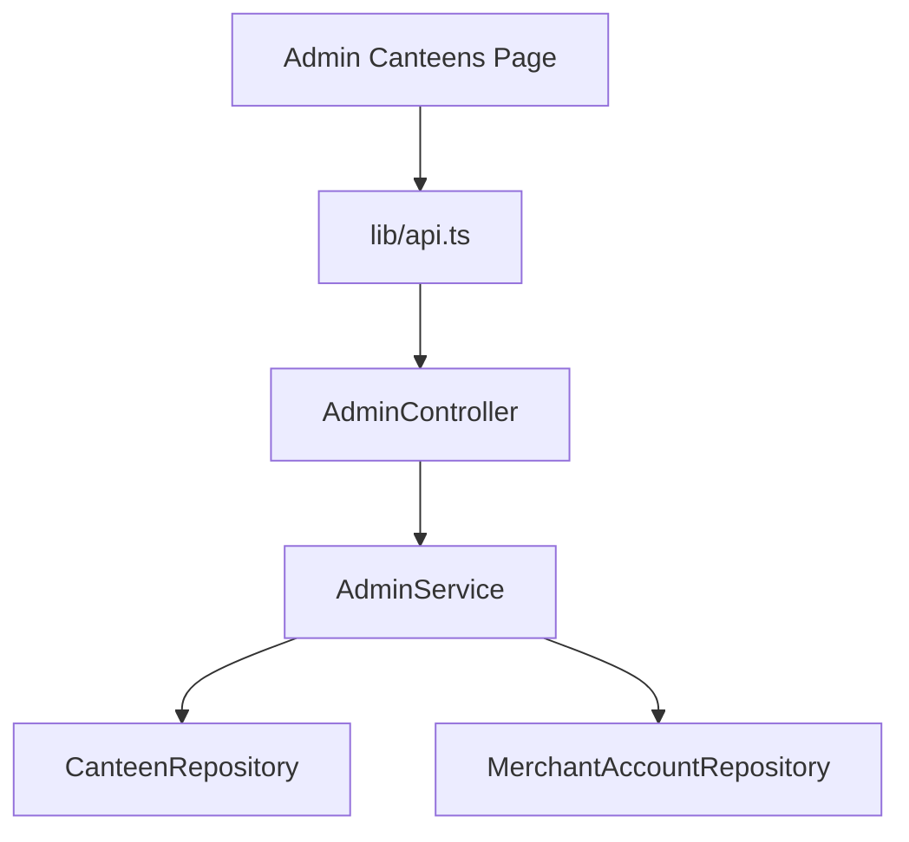

# Design Document - Merchant Management

## Overview
This feature allows system administrators to manage merchants by creating new canteens with associated administrator accounts, viewing those accounts, and resetting their passwords. It involves updates to the backend controllers and services, and adding new modal components to the frontend admin dashboard.

## Steering Document Alignment
- **Technical Standards (tech.md)**: Follows the existing Spring Boot + React (Next.js) architecture. Uses MapStruct for DTO mapping and BCrypt for password hashing.
- **Project Structure (structure.md)**: Adheres to the established package structure for controllers, services, repositories, and DTOs.

## Code Reuse Analysis
### Existing Components to Leverage
- **AdminController**: Extend to include merchant management endpoints.
- **MerchantAccountService**: Use for account creation and password updates.
- **CanteenService**: Use for saving canteen entities.
- **EntityMapper**: Add mappings for `MerchantAccount` to `MerchantAccountDTO`.
- **UI Styles**: Use `page.module.css` from the canteens page for consistent styling.

### Integration Points
- **Database**: Connects to `canteen` and `merchant_account` tables.
- **Spring Security**: Operations restricted to `ROLE_ADMIN`.

## Architecture
The implementation follows a standard layered architecture:
`Frontend (React/Modal) -> API Client -> Controller -> Service -> Repository -> Database`



## Components and Interfaces

### Backend: AdminController
- **Endpoints:**
  - `GET /api/v1/admin/canteens`: Returns all canteens.
  - `POST /api/v1/admin/merchants`: Creates both canteen and merchant account.
  - `GET /api/v1/admin/merchants/{canteenId}/accounts`: Lists accounts for a canteen.
  - `PATCH /api/v1/admin/merchants/accounts/{accountId}/password`: Resets a merchant account's password.

### Frontend: Modals
- **AddMerchantModal**: Form for both canteen details and administrator account details.
- **MerchantAccountListModal**: Display accounts for a selected canteen with "Reset Password" action.
- **ResetPasswordModal**: Simple prompt for a new password.

## Data Models

### CreateMerchantRequest (Backend DTO)
```java
public class CreateMerchantRequest {
    // Canteen details
    private String name;
    private String campus;
    private String address;
    private String imageUrl;
    // Initial account details
    private String username;
    private String password;
    private String realName;
    private String mobile;
}
```

### MerchantAccountDTO (Backend DTO)
```java
public class MerchantAccountDTO {
    private Long merchantAccountId;
    private String username;
    private String realName;
    private String mobile;
    private String role;
    private Integer status;
}
```

## Error Handling

### Error Scenarios
1. **Duplicate Username:**
   - **Handling:** Return 400 Bad Request with "Username already exists" message.
   - **User Impact:** Merchant creation fails, admin sees error message.
2. **Canteen Not Found:**
   - **Handling:** Return 404 for account listing/password reset if canteen ID is invalid.
   - **User Impact:** Admin sees "Merchant not found".

## Testing Strategy

### Unit Testing
- Test `AdminService.createMerchant` for transactional integrity (both canteen and account must succeed).
- Test password reset logic to ensure hashing.

### Integration Testing
- Verify that only admins can access these endpoints.
- Verify end-to-end flow: Create merchant -> Login with new account.
