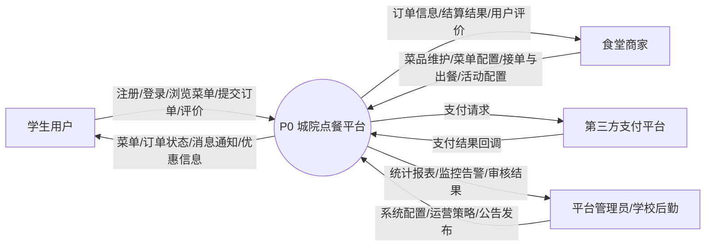
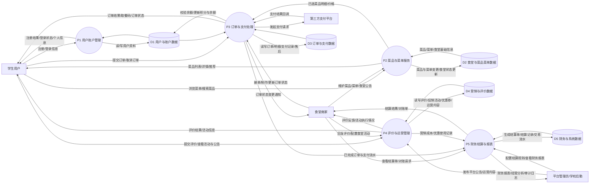
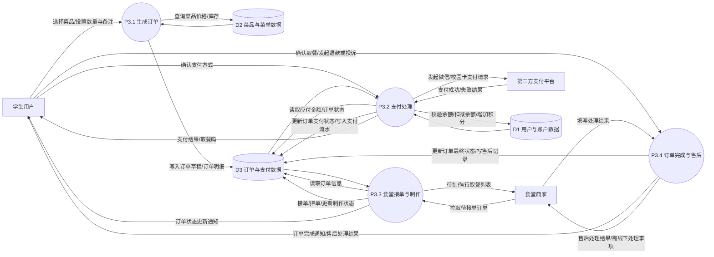

# L0
--------

```mermaid
flowchart LR
  %% 外部实体
  U[学生用户]
  M[食堂商家]
  Pay[第三方支付平台]
  A[平台管理员/学校后勤]

  %% 顶层过程（整个系统）
  S((P0 城院点餐平台))

  %% 用户与系统
  U -->|注册/登录/浏览菜单/提交订单/评价| S
  S -->|菜单/订单状态/消息通知/优惠信息| U

  %% 商家与系统
  M -->|菜品维护/菜单配置/接单与出餐/活动配置| S
  S -->|订单信息/结算结果/用户评价| M

  %% 支付平台与系统
  S -->|支付请求| Pay
  Pay -->|支付结果回调| S

  %% 管理员与系统
  A -->|系统配置/运营策略/公告发布| S
  S -->|统计报表/监控告警/审核结果| A
```
# L1
----

```mermaid
flowchart LR
  %% 外部实体
  U[学生用户]
  M[食堂商家]
  Pay[第三方支付平台]
  A[平台管理员/学校后勤]

  %% 数据存储（逻辑数据仓）
  D1[(D1 用户与账户数据)]
  D2[(D2 食堂与菜品菜单数据)]
  D3[(D3 订单与支付数据)]
  D4[(D4 营销与评价数据)]
  D5[(D5 财务与系统数据)]

  %% 过程
  P1((P1 用户账户管理))
  P2((P2 菜品与菜单服务))
  P3((P3 订单与支付处理))
  P4((P4 评价与运营管理))
  P5((P5 财务结算与报表))

  %% ---------- P1 用户账户管理 ----------
  U -->|注册/登录信息| P1
  P1 -->|注册结果/登录状态/个人信息| U
  P1 -->|读/写用户资料| D1
  D1 --> P1

  %% ---------- P2 菜品与菜单服务 ----------
  U -->|浏览菜单/搜索菜品| P2
  P2 -->|菜品列表/详情/推荐| U

  M -->|维护菜品/菜单/食堂公告| P2
  P2 -->|菜品与菜单变更/食堂状态更新| D2
  D2 -->|菜品/菜单/食堂基础信息| P2

  %% ---------- P3 订单与支付处理 ----------
  U -->|提交订单/取消订单| P3
  P2 -->|已选菜品明细/价格| P3
  P3 -->|订单结果/取餐码/订单状态| U

  M -->|接单/制作/更新订单状态| P3
  P3 -->|订单状态变更通知| M

  P3 -->|读写订单/明细/支付记录/售后| D3
  D3 --> P3

  P3 -->|校验余额/更新积分与余额| D1
  D1 --> P3

  P3 -->|发起支付请求| Pay
  Pay -->|支付结果回调| P3

  %% ---------- P4 评价与运营管理 ----------
  U -->|提交评价/查看活动与公告| P4
  M -->|回复评价/配置食堂活动| P4
  A -->|发布平台公告/运营内容| P4

  P4 -->|读写评价/促销活动/优惠券/运营内容| D4
  D4 --> P4

  P4 -->|评价结果/活动信息| U
  P4 -->|评价反馈/活动执行情况| M

  %% ---------- P5 财务结算与报表 ----------
  M -->|查看结算单/对账请求| P5
  A -->|配置结算规则/查看财务报表| P5

  P3 -->|已完成订单与支付流水| P5
  P4 -->|营销成本/优惠使用记录| P5

  P5 -->|生成结算单/结算记录/交易流水| D5
  D5 --> P5

  P5 -->|结算结果/对账单| M
  P5 -->|财务报表/经营分析/审计日志| A
```
# L2
----

```mermaid
flowchart LR
  %% 外部实体
  U[学生用户]
  M[食堂商家]
  Pay[第三方支付平台]

  %% 数据存储
  D1[(D1 用户与账户数据)]
  D2[(D2 菜品与菜单数据)]
  D3[(D3 订单与支付数据)]

  %% 子过程
  P31((P3.1 生成订单))
  P32((P3.2 支付处理))
  P33((P3.3 食堂接单与制作))
  P34((P3.4 订单完成与售后))

  %% ---------- P3.1 生成订单 ----------
  U -->|选择菜品/设置数量与备注| P31
  P31 -->|查询菜品价格/库存| D2
  D2 --> P31
  P31 -->|写入订单草稿/订单明细| D3

  %% ---------- P3.2 支付处理 ----------
  U -->|确认支付方式| P32
  P32 -->|读取应付金额/订单状态| D3
  D3 --> P32

  P32 -->|校验余额/扣减余额/增加积分| D1
  D1 --> P32

  P32 -->|发起微信/校园卡支付请求| Pay
  Pay -->|支付成功/失败结果| P32

  P32 -->|更新订单支付状态/写入支付流水| D3
  P32 -->|支付结果/取餐码| U

  %% ---------- P3.3 食堂接单与制作 ----------
  M -->|拉取待接单订单| P33
  P33 -->|读取订单信息| D3
  D3 --> P33

  P33 -->|接单/拒单/更新制作状态| D3
  P33 -->|订单状态更新通知| U
  P33 -->|待制作/待取餐列表| M

  %% ---------- P3.4 订单完成与售后 ----------
  U -->|确认取餐/发起退款或投诉| P34
  M -->|填写处理结果| P34

  P34 -->|更新订单最终状态/写售后记录\n| D3
  P34 -->|订单完成通知/售后处理结果| U
  P34 -->|售后处理结果/需线下处理事项| M

```